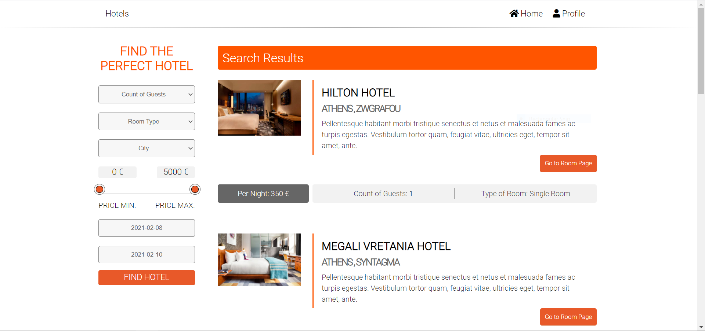
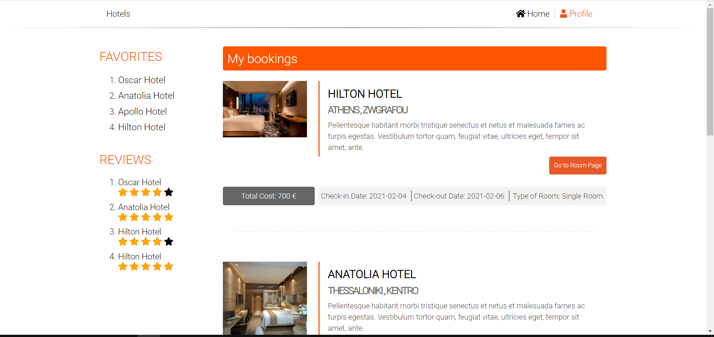
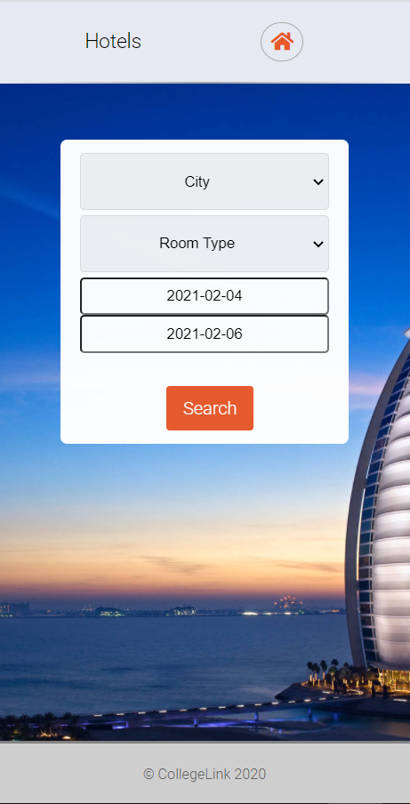
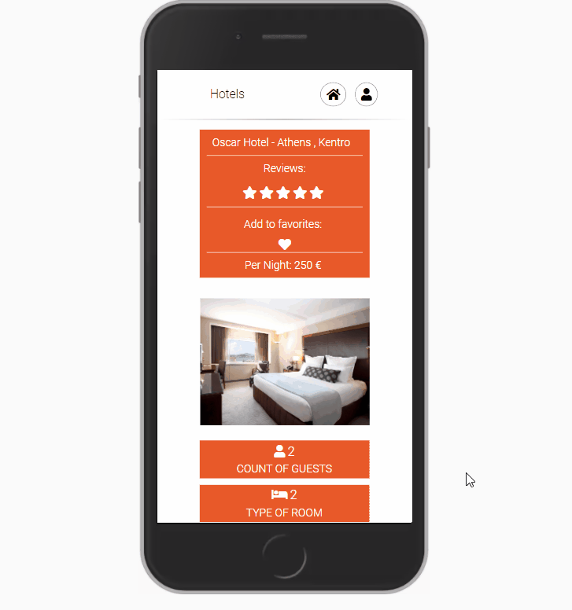
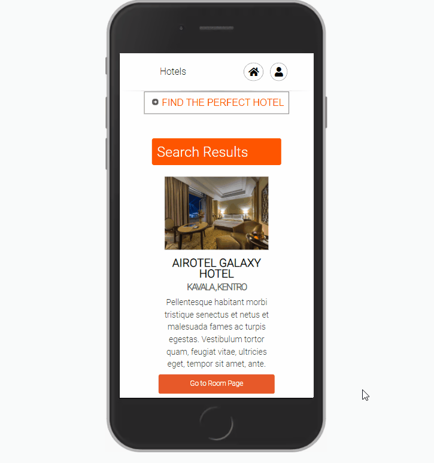

# Web Development Academy project
This project is part of the hands-on experience for the Web Developmnet eLearning Academy by College Link.

The functionality for a Hotel searching Web App is implemented.

Technologies used:
- HTML
- CSS
- JavaScript
- JQuery (Ajax)
- PHP
- MySQL

## Screenshots ##

### Desktop view ###
 

### Mobile View ###
 

